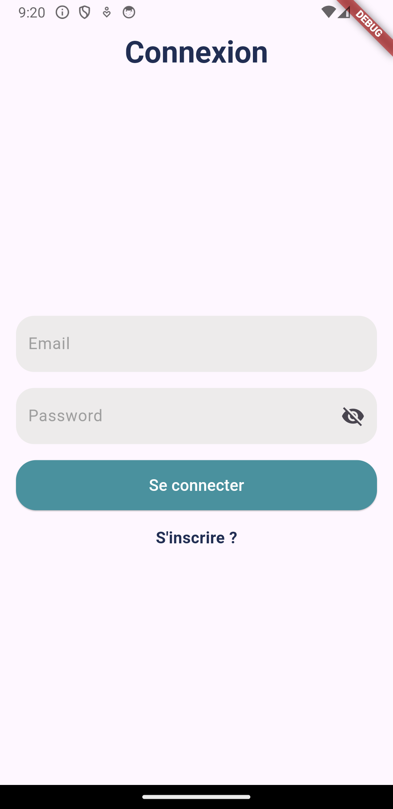
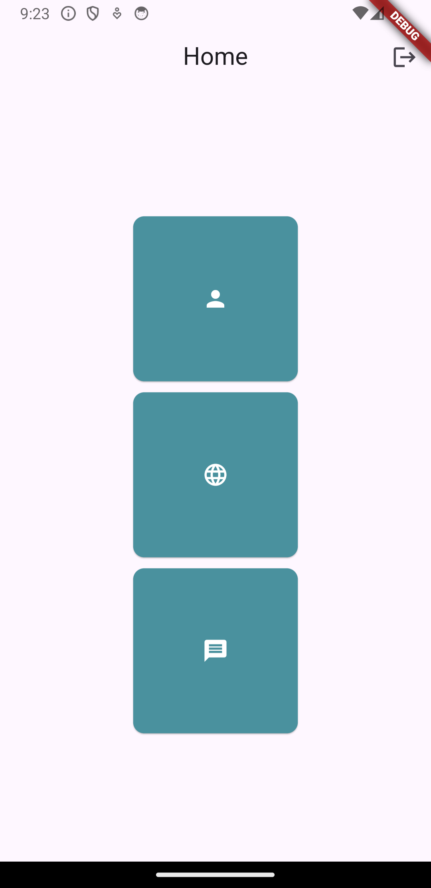
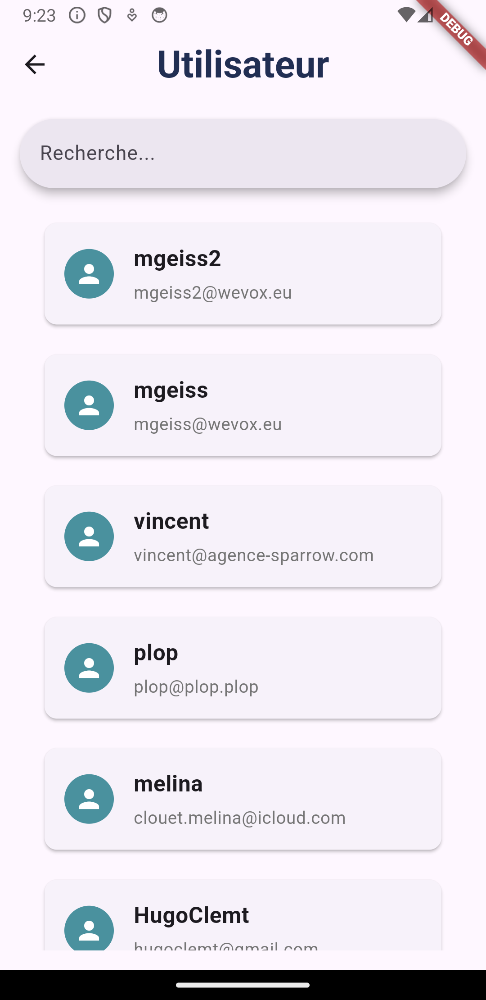
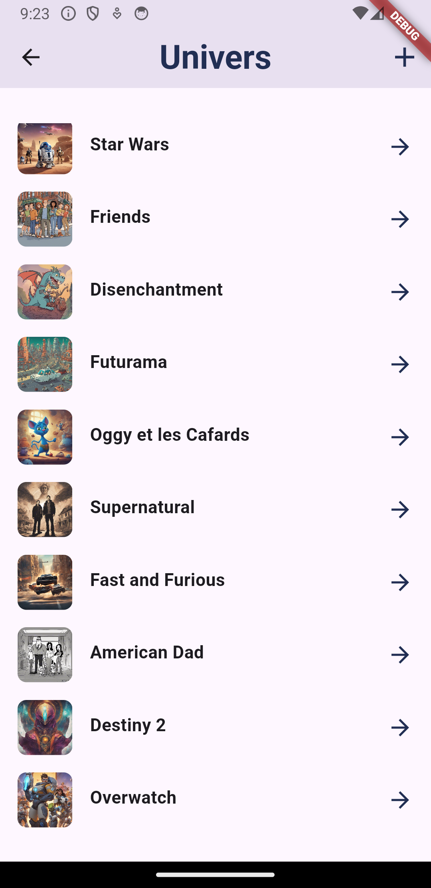
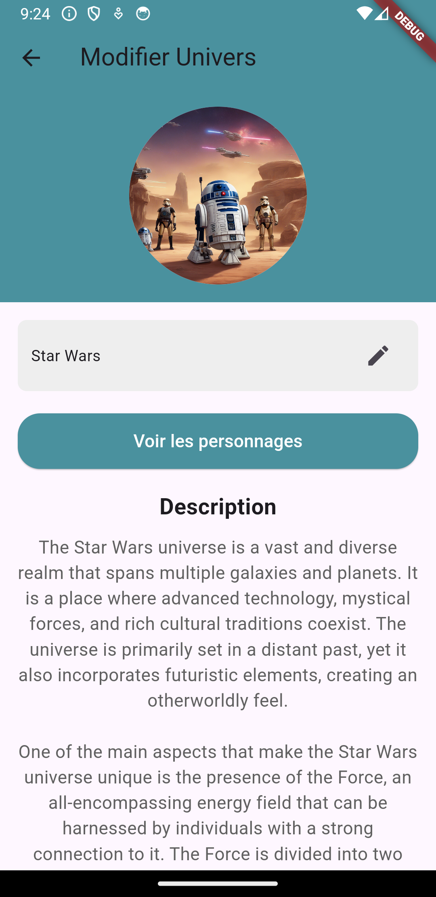
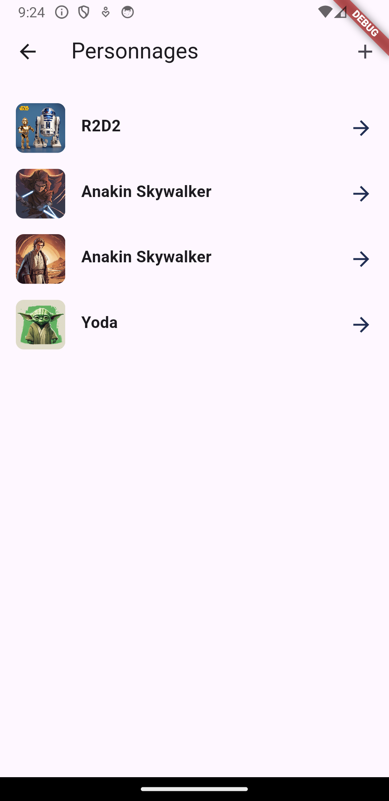
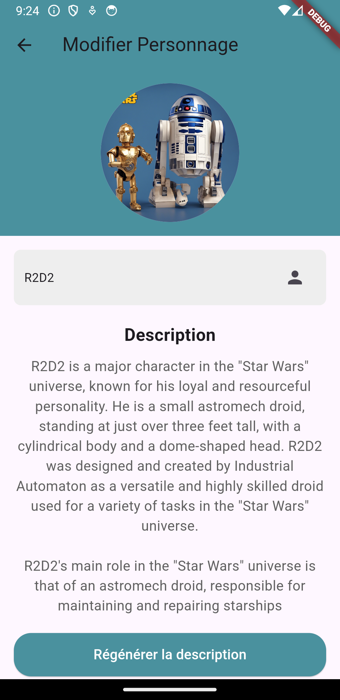
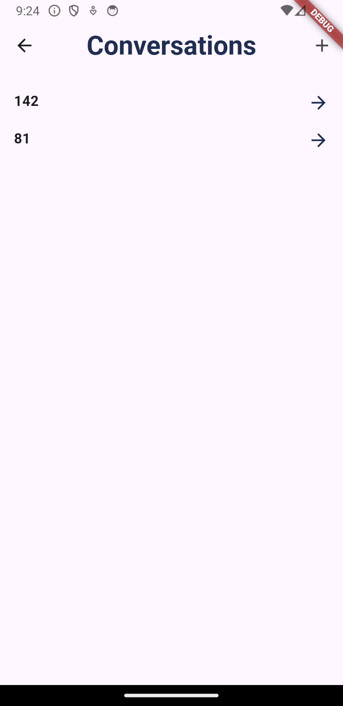
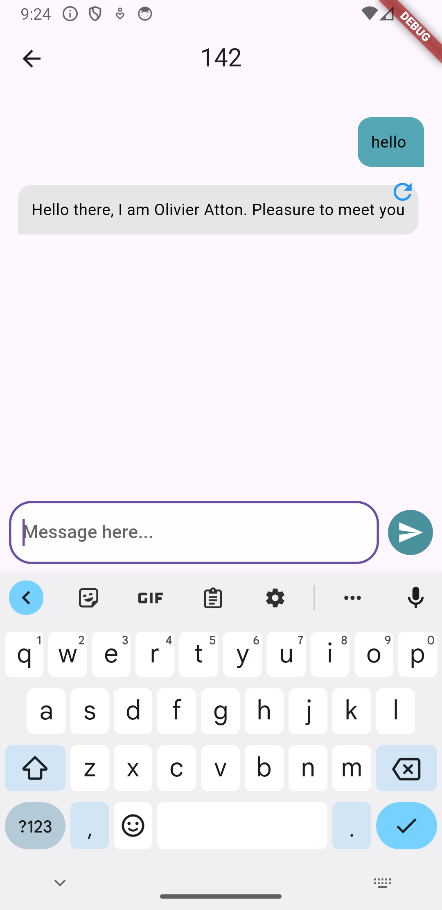

# mds_flutter_application

## Les captures d'écran :
Connexion                |   Inscription    |  Accueil               | Utilisateurs                
:-------------------------:|:-------------------------:|:-------------------------:|:-------------------------: |
  | |  |  
 

Univers               |   Modifier Univers    |      Personnages               |   Modifier Personnage   |         
:-------------------------:|:-------------------------:|:-------------------------:|:-------------------------:
  | |  | 

Conversations               |   Messagerie    |              
:-------------------------:|:-------------------------:
  | 
